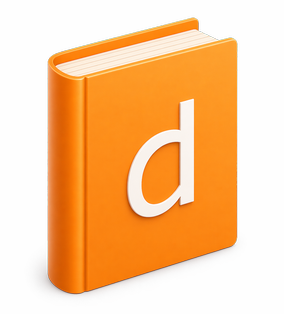

# Translate with dict.cc

Windows app to search and manage [dict.cc](https://www.dict.cc/) offline dictionaries

## Features
* Import offline dictionary files downloaded from dict.cc
* All 27 languages of dict.cc are supported
* Play back pronounciation samples (internet connection required)
* Light and dark mode
* Localized app for English and German

## Screenshots

## License
GPLv3, see [LICENSE](LICENSE)
